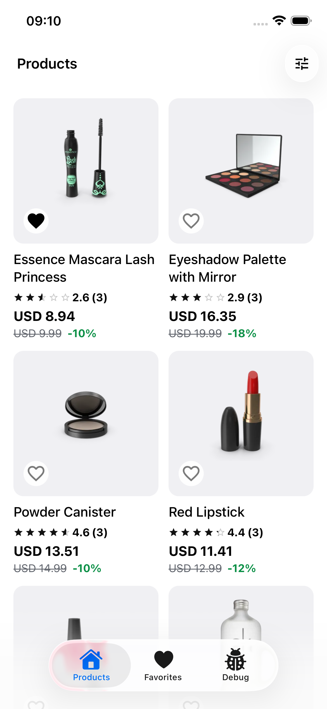
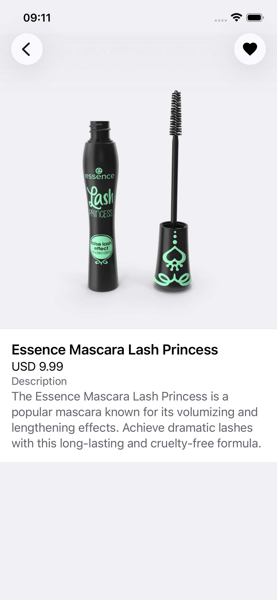
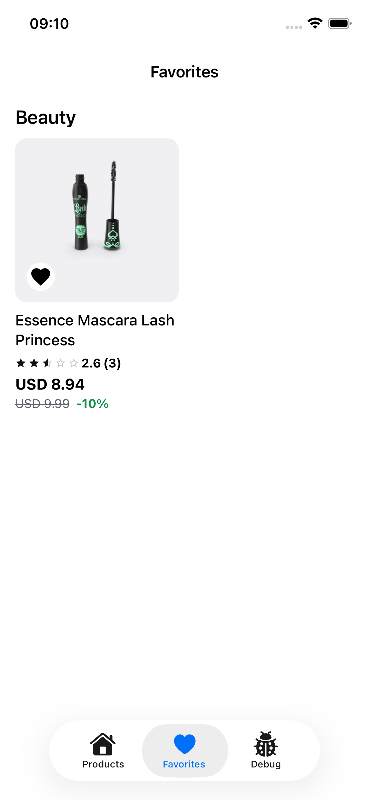
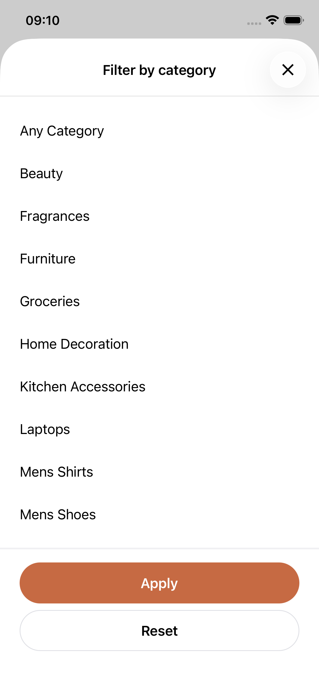

# ProductExplorer

Mobile app for browsing products, viewing details, and managing favorites.

## Project configuration

Core app configuration is defined in `app.config.ts`:

- App name/slug: `ProductExplorer`
- iOS bundle id: `com.productexplorer.app`
- Android package: `com.productexplorer.app`
- Version: `1.0.0`
- Orientation: portrait
- Deep link scheme: `productexplorer`
- Build plugins: `expo-localization`, `expo-splash-screen`, `expo-build-properties`

## Tech stack

- Expo SDK 55
- React Native 0.83
- React Navigation
- React Query
- Zustand
- Jest + Testing Library
- Detox (E2E)

## Requirements

- Node.js 20+
- `pnpm` (project uses `pnpm@10.17.1`)
- Xcode (for iOS)
- Android Studio + SDK/emulator (for Android)
- Watchman (recommended on macOS)

## Quick start for new developers

1. Install dependencies

   ```bash
   pnpm install
   ```

2. Start Metro

   ```bash
   pnpm start
   ```

3. Run the app

   ```bash
   pnpm ios
   # or
   pnpm android
   ```

## EAS build and submit (iOS + Android)

1. Log in to Expo (one time per machine/session as needed):

   ```bash
   pnpm dlx eas login
   ```

2. Build with EAS using the project scripts:

   ```bash
   # iOS
   pnpm build:ios:development
   pnpm build:ios:adhoc
   pnpm build:ios:production

   # Android
   pnpm build:android:development
   pnpm build:android:adhoc
   pnpm build:android:production
   ```

3. Submit iOS builds with matching submit scripts:

   ```bash
   pnpm submit:ios:development
   pnpm submit:ios:adhoc
   pnpm submit:ios:production
   ```

`eas.json` is preconfigured with `development`, `adhoc`, and `production` profiles. Build scripts exist for iOS and Android, and submit scripts are currently set up for iOS.

## Development commands

```bash
pnpm lint
pnpm lint:fix
pnpm format
pnpm format:check
pnpm test
pnpm test:watch
```

## Tests

### Unit/integration tests

```bash
pnpm test
```

Pre-commit hook runs:

1. `lint-staged`
2. `jest` (bail + runInBand)

So commits fail when tests fail.

### Detox E2E

Detox config: `.detoxrc.js`  
Detox Jest config: `e2e/jest.config.js`

Build and run iOS debug E2E:

```bash
pnpm e2e:build:ios:debug
pnpm e2e:test:ios:debug
```

Current E2E scenario:

- Launch app
- Open first product
- Add product to favorites
- Relaunch app
- Open Favorites tab
- Verify favorite state is persisted

## Screenshots

Add screenshots under `docs/screenshots/` using the file names below:

- `docs/screenshots/ios-products.png`
- `docs/screenshots/ios-product-detail.png`
- `docs/screenshots/android-products.png`
- `docs/screenshots/android-product-detail.png`

Then they will render here:

### iOS

<div style="overflow-x: auto; white-space: nowrap; padding-bottom: 8px;">
  
  
  
  
</div>

### Android

Screenshots to be uploaded...
